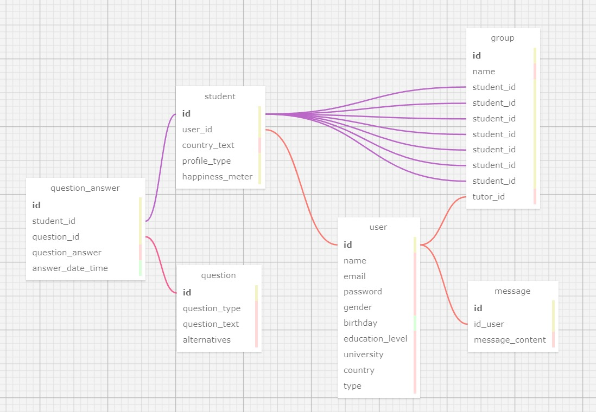

## Modelagem do banco de dados

&nbsp;&nbsp;&nbsp;&nbsp;O modelo relacional de banco de dados foi feito no site `https://sql.toad.cz/` organizando as informações de forma que se relacionem de acordo com o propósito do projeto. O modelo apresenta cada tabela como uma entidade que possui uma lista de atributos, estabelecendo relações entre elas. Abaixo estão detalhadas as tabelas e seus respectivos atributos, sendo eles as chaves primárias e chaves estrangeiras:

<div align="center">
<sub>Figura 1 - Estrutura do banco de dados em XML</sub>

<sup>Fonte: Material produzido pelo autor (2024)</sup>
</div>

### Tabela: `User`

- **id** (INTEGER, CHAVE PRIMÁRIA)
- **name** (TEXT)
- **email** (TEXT)
- **password** (TEXT)
- **gender** (TEXT)
- **birthday** (DATE)
- **education_level** (VARCHAR)
- **university** (VARCHAR)
- **country** (INTEGER)
- **type** (BINARY)

### Tabela: `message`

- **id** (INTEGER, CHAVE PRIMÁRIA)
- **user_id** (INTEGER, CHAVE ESTREANGEIRA referenciando `User(id)`)
- **message_content**

### Tabela: `Student`

- **id** (INTEGER, CHAVE PRIMÁRIA)
- **user_id** (INTEGER, CHAVE ESTRANGEIRA referenciando `User(id)`)
- **country_text_** (TEXT)
- **profile_type** (VARCHAR)
- **happiness_meter** (INTEGER)

### Tabela: `Group`

- **id** (INTEGER, CHAVE PRIMÁRIA)
- **name** (TEXT)
- **tutor_id** (INTEGER, CHAVE ESTRANGEIRA referenciando `User(id)`)
- **student_id** (INTEGER, CHAVE ESTRANGEIRA referenciando `Student(id)`)

### Tabela: `Question`

- **id** (INTEGER, CHAVE PRIMÁRIA)
- **question_text** (INTEGER)
- **alternatives** (VARCHAR)
- **question_type** (VARCHAR)

### Tabela: `QuestionAnswer`

- **id** (INTEGER, CHAVE PRIMÁRIA)
- **student_id** (INTEGER, CHAVE ESTRANGEIRA referenciando `Student(id)`)
- **question_id** (INTEGER, CHAVE ESTRANGEIRA referenciando `Question(id)`)
- **question_answer** (VARCHAR)
- **answer_date_time** (DATETIME)

## Relacionamentos

- A tabela `User` é central, conectando-se com `Group`, `Message` e `Student` através de chaves estrangeiras.
- `Question` e `QuestionAnswer` ligam perguntas às respostas dos usuários.
- `Student` se conecta a `Group`, relacionando jogadores com seus grupos e conecta-se à `question_answer` para mostrar qual estudante forneceu determinada resposta.

```sql

-- Creating User table
CREATE TABLE Users (
    id SERIAL PRIMARY KEY,
    name VARCHAR,
    email VARCHAR,
    password VARCHAR,
    gender VARCHAR,
    birthday DATE,
    education_level VARCHAR,
    university VARCHAR,
    country VARCHAR
);

-- Creating Student table
CREATE TABLE Student (
    id SERIAL PRIMARY KEY,
    user_id INTEGER,
    Country_text TEXT,
    profile_type VARCHAR,
    happiness_meter INTEGER
);

-- Creating Group table
CREATE TABLE Group (
    id SERIAL PRIMARY KEY,
    name VARCHAR,
    student_id INTEGER,
    tutor_id INTEGER,
    FOREIGN KEY (student_id) REFERENCES Users(id),
    FOREIGN KEY (tutor_id) REFERENCES Users(id)
);

-- Creating Question table
CREATE TABLE Question (
    id SERIAL PRIMARY KEY,
    question_type VARCHAR,
    question_text VARCHAR,
    alternatives VARCHAR
);

-- Creating Student table
CREATE TABLE Student (
    id SERIAL PRIMARY KEY,
    user_id INTEGER,
    country_pov VARCHAR,
    profile_type VARCHAR,
    happiness_meter INTEGER,
    FOREIGN KEY (user_id) REFERENCES Users(id)
);

-- Creating QuestionAnswer table
CREATE TABLE QuestionAnswer (
    id SERIAL PRIMARY KEY,
    student_id INTEGER,
    question_id INTEGER,
    question_answer VARCHAR,
    answer_date_time DATETIME,
    FOREIGN KEY (student_id) REFERENCES Users(id),
    FOREIGN KEY (question_id) REFERENCES Question(id)
);

```


&nbsp;&nbsp;&nbsp;&nbsp;As linhas desempenham o papel de conectar as tabelas, relacionando informações e atributos. Por exemplo, a tabela "Group" se relaciona com a tabela "Student" através do atributo "student_id", indicando que todos os usuários pertencem a um grupo. Esta estrutura facilita o entendimento do processo interno de dados, ajudando na implantação de um banco de dados para um projeto e servindo como material de consulta.

## Cardinalidade

### Cardinalidade: User e Message
- **1 para 1**

### Cardinalidade: User e Group
- **1 para 1**

### Cardinalidade: Group e Student
- **1 para N**

### Cardinalidade: User e Message
- **1 para 1**

### Cardinalidade: User e Student
- **1 para 1**

### Cardinalidade: Student e Question_answer
- **1 para N**

### Cardinalidade: Question_answer e Question
- **1 para 1**